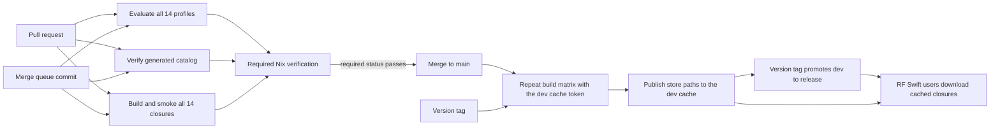

# GitHub CI/CD for RF Swift Nix

The current Nix environment release line is **v1.0.0-dev** from `main`.

## Independent architecture cache workflows

- `cache-amd64.yml` builds native `x86_64-linux` closures.
- `cache-arm64.yml` builds on GitHub's native `ubuntu-24.04-arm` runner.
- `cache-riscv64.yml` builds `riscv64-linux` with registered QEMU user-mode
  emulation.

The workflows do not depend on each other and every matrix uses
`fail-fast: false`. Each job publishes to the self-hosted attic binary cache
(`nix-cache-infra/`): it pulls the `dev` cache first, uploads store paths while
it builds (`attic watch-store`), and pushes the finished closure, so a later
package failure does not discard paths that were already built.
Every environment uploads its full build log, a JSON result and a Markdown
diagnostic extract. A final per-architecture report aggregates the results and
is produced even when builds fail.

Set repository secret `ATTIC_TOKEN_DEV`. Trusted pushes publish cache paths;
fork pull requests receive no credential and build without the cache.

The repository's `CI` workflow is both the ground-truth build gate and the Nix
delivery pipeline. Pull requests prove that the definitions still evaluate and
that every complete environment closure builds. Trusted pushes to `main` and
version tags run the same checks and publish the resulting Nix store paths to
the `dev` cache; a version tag then promotes them to `release`
(`promote-release.yml`), so users normally download binaries rather than
compiling locally.



## Self-hosted attic cache (dev / release)

The cache is the attic server described in `nix-cache-infra/`
(`nixcache-dev.penthertz.com` serves `dev`, `nixcache.penthertz.com` serves
`release`; hostnames come from `nix-cache-infra/settings.nix`, CI only supplies
tokens).

- `cache-amd64.yml` and `cache-arm64.yml` run on every branch push, `v*` tags,
  and fork pull requests. `cache-riscv64.yml` (QEMU user-mode, slow) runs only
  for `main`, tags and manual dispatch.
- Every environment job pulls from `dev`, uploads store paths while it builds,
  and pushes its closure when done. A failed environment still leaves its
  finished dependencies in the cache, so the next run resumes there.
- `promote-release.yml` runs on `v*` tags and copies every environment closure
  for all three systems from `dev` to `release` with `--max-jobs 0`, so nothing
  is ever compiled on the promote runner; a closure that never reached `dev`
  fails visibly in the matrix.

Secrets: `ATTIC_TOKEN_DEV` (pull+push dev), `ATTIC_TOKEN_RELEASE` (pull dev,
push release), `CACHE_PUBLIC_KEY_DEV` (output of `attic cache info dev`).
Minting them is covered in `nix-cache-infra/SETUP.md`, section 6.

## One-time GitHub setup

1. Deploy the attic cache and mint the CI tokens (`nix-cache-infra/SETUP.md`,
   sections 5 and 6).
2. In the GitHub repository, open **Settings → Secrets and variables →
   Actions**.
3. Add the repository secrets `ATTIC_TOKEN_DEV`, `ATTIC_TOKEN_RELEASE` and
   `CACHE_PUBLIC_KEY_DEV`. Do not put the tokens in the repository or expose
   them to pull request code.
4. Point your own machine at `dev` (see `nix-cache-infra/SETUP.md`, 7.3) so
   local builds reuse what CI already compiled.
5. Under **Settings → Rules → Rulesets** (or branch protection), protect
   `main`, require pull requests, and require the status check
   **Required Nix verification**. Requiring the single aggregate check avoids
   maintaining 14 matrix check names in the ruleset.
6. Optionally enable GitHub's merge queue. The workflow listens for
   `merge_group`, so the required check is rerun on the exact synthetic commit
   that the queue intends to merge.

Fork pull requests receive no attic secret. They run the complete matrix
without the cache and cannot publish paths. Only trusted `push` events log in
to the cache.

## What each event does

| Event | Evaluate/catalog | Build + command smoke | Push to dev cache |
|---|---:|---:|---:|
| Pull request | yes | all 14 environments | no |
| Merge queue | yes | all 14 environments | no |
| Push to any branch | yes | all 14 environments (riscv64: `main` only) | yes |
| Tag matching `v*` | yes | all 14 environments | yes, then promoted to release |
| Manual dispatch | yes | all 14 environments | yes |

The matrix uses at most four runners concurrently and gives each environment
two hours. `fail-fast` is disabled so one bad package does not hide failures in
other environments. A superseded pull-request run is cancelled, while trusted
publishing runs are allowed to finish.

## Cost

For a **public** repository, GitHub currently makes standard GitHub-hosted
runners such as `ubuntu-latest` free and unlimited. This workflow uses those
standard runners; it does not request paid larger runners. The four-job
`max-parallel` setting limits concurrency, not billing. GitHub counts the
duration of every matrix job separately, so a private-repository run can consume
far more minutes than its wall-clock duration.

For a **private** repository, GitHub's included monthly allowance currently
starts at 2,000 minutes for GitHub Free/free organizations and 3,000 minutes for
Pro/Team; usage beyond the applicable allowance can be billed. Check the
[current GitHub Actions billing documentation](https://docs.github.com/en/billing/concepts/product-billing/github-actions)
before changing repository visibility or runner labels. Larger GitHub-hosted
runners are billed even for public repositories.

The binary cache is self-hosted: attic on a small OVH VPS with the NARs in OVH
Object Storage (S3), so storage cost scales with the size of RF Swift's custom
closures rather than a fixed allowance. Paths that `cache.nixos.org` already
serves are not duplicated. attic garbage-collects unreferenced paths on the
retention configured in `nix-cache-infra/modules/attic.nix`; an evicted path is
rebuilt or fetched from another substituter, it never breaks a build. This is
distinct from the temporary disk on a GitHub-hosted runner: standard Linux
runners currently expose about 14 GB of local SSD space, and filling that
filesystem can fail the current job with `No space left on device`. A later job
starts on a fresh runner.

The workflow does not upload GitHub Actions artifacts, so it does not currently
consume Actions artifact-storage quota. Logs are retained by GitHub according
to the repository's retention settings.

## Release coordination with the RF Swift binary

The Nix repository and the Go CLI are separate release units. A reliable
release sequence is:

1. Merge the Nix change only after **Required Nix verification** passes.
2. Wait for the trusted `main` build to finish publishing all closures.
3. Create an `RF-Swift-nix` version tag and confirm its matrix is green.
4. Regenerate/copy `catalog.json` into `RF-Swift/go/rfswift/nix/catalog.json`,
   then let the CLI repository's catalog-sync test verify byte-for-byte parity.
5. Tag `RF-Swift`. Its release workflow should test the Go CLI, produce clean
   cross-platform archives and checksums, and attach build provenance.

Until that cross-repository catalog update is automated, the catalog parity
check is the essential manual hand-off between the two repositories.

## Diagnosing failures

- **Evaluation failure:** inspect the affected `eval-check` matrix job. This
  normally indicates licensing, platform, broken-package, or dependency
  resolution trouble before compilation begins.
- **Build failure:** inspect `Build and smoke / <environment>` and find the
  first failed `.drv`; warnings from older upstream code are not themselves a
  failure.
- **Command smoke failure:** the closure built, but a package's
  `meta.mainProgram` does not match an executable exposed in the aggregate
  profile. Correct the package metadata; do not weaken the smoke test.
- **attic login / push failure:** verify that `ATTIC_TOKEN_DEV` is a valid,
  unexpired token with pull+push on `dev` (`nix-cache-infra/scripts/mint-token.sh
  ci-dev`) and that `nix-cache-infra/settings.nix` names the right hosts. A
  promote failure with "max-jobs 0" means the closure never reached `dev`.
- **Required check is missing in a merge queue:** verify that the workflow still
  includes the `merge_group` trigger and that the ruleset requires the stable
  aggregate check, not a conditional matrix child.

The equivalent local commands are:

```bash
./tests/verify.sh
./tests/smoke-environment.sh automotive
```

Run the smoke script for every catalog environment to reproduce the complete
CI matrix locally.
