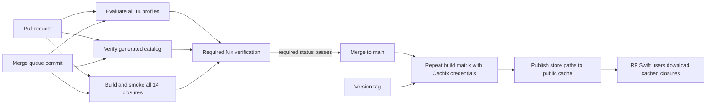

# GitHub CI/CD for RF Swift Nix

The current Nix environment release line is **v1.0.0-dev** from `main`.

## Independent architecture cache workflows

- `cache-amd64.yml` builds native `x86_64-linux` closures.
- `cache-arm64.yml` builds on GitHub's native `ubuntu-24.04-arm` runner.
- `cache-riscv64.yml` builds `riscv64-linux` with registered QEMU user-mode
  emulation.

The workflows do not depend on each other and every matrix uses
`fail-fast: false`. Cachix uploads successful derivations as they are realised,
so a later package failure does not discard paths that were already built.
Every environment uploads its full build log, a JSON result and a Markdown
diagnostic extract. A final per-architecture report aggregates the results and
is produced even when builds fail.

Set repository variable `CACHIX_CACHE` and secret `CACHIX_AUTH_TOKEN`. Trusted
pushes publish cache paths; pull requests receive no write credential and use
the public cache read-only.

The repository's `CI` workflow is both the ground-truth build gate and the Nix
delivery pipeline. Pull requests prove that the definitions still evaluate and
that every complete environment closure builds. Trusted pushes to `main` and
version tags run the same checks and publish the resulting Nix store paths to
Cachix, so users normally download binaries rather than compiling locally.



## One-time GitHub setup

1. Create a public Cachix cache, for example `rfswift`.
2. In the GitHub repository, open **Settings → Secrets and variables →
   Actions**.
3. Add the repository variable `CACHIX_CACHE` with the cache name.
4. Add the repository secret `CACHIX_AUTH_TOKEN` using a token allowed to push
   to that cache. Do not put this token in the repository or expose it to pull
   request code.
5. Under **Settings → Rules → Rulesets** (or branch protection), protect
   `main`, require pull requests, and require the status check
   **Required Nix verification**. Requiring the single aggregate check avoids
   maintaining 14 matrix check names in the ruleset.
6. Optionally enable GitHub's merge queue. The workflow listens for
   `merge_group`, so the required check is rerun on the exact synthetic commit
   that the queue intends to merge.

Fork pull requests receive no Cachix secret. They can read the public cache and
run the complete matrix, but cannot publish paths. Only trusted `push` events
configure the writable cache action.

## What each event does

| Event | Evaluate/catalog | Build + command smoke | Push to Cachix |
|---|---:|---:|---:|
| Pull request | yes | all 14 environments | no |
| Merge queue | yes | all 14 environments | no |
| Push to `main` | yes | all 14 environments | yes |
| Tag matching `v*` | yes | all 14 environments | yes |
| Manual dispatch | yes | all 14 environments | no |

The matrix uses at most four runners concurrently and gives each environment
two hours. `fail-fast` is disabled so one bad package does not hide failures in
other environments. A superseded pull-request run is cancelled, while trusted
publishing runs are allowed to finish.

## Cost

For a **public** repository, GitHub currently makes standard GitHub-hosted
runners such as `ubuntu-latest` free and unlimited. This workflow uses those
standard runners; it does not request paid larger runners. The four-job
`max-parallel` setting limits concurrency, not billing. GitHub counts the
duration of every matrix job separately, so a private-repository run can consume
far more minutes than its wall-clock duration.

For a **private** repository, GitHub's included monthly allowance currently
starts at 2,000 minutes for GitHub Free/free organizations and 3,000 minutes for
Pro/Team; usage beyond the applicable allowance can be billed. Check the
[current GitHub Actions billing documentation](https://docs.github.com/en/billing/concepts/product-billing/github-actions)
before changing repository visibility or runner labels. Larger GitHub-hosted
runners are billed even for public repositories.

Cachix is a separate service. Its current open-source allowance is 5 GB. Paths
already available from `cache.nixos.org` are not duplicated, which means the
allowance is mainly consumed by RF Swift's custom builds. Cachix reports that it
compresses entries and removes least-recently-used entries after the storage
limit is reached. See the [current Cachix pricing page](https://www.cachix.org/pricing).
If RF Swift's custom closures exceed that allowance or older cached releases
must remain permanently available, a paid Cachix plan or a self-hosted binary
cache will be needed.

Reaching a Cachix limit—whether a plan provides 5 GB, 50 GB, or another
amount—does **not** stop Nix or crash compilation. Cachix evicts older paths;
the next consumer downloads an evicted path from another configured binary
cache when possible, or rebuilds it from source. The practical effect is lower
cache hit rate and longer CI/user builds. This is distinct from the temporary
disk on a GitHub-hosted runner: standard Linux runners currently expose about
14 GB of local SSD space, and filling that filesystem can fail the current job
with `No space left on device`. A later job starts on a fresh runner.

The workflow does not upload GitHub Actions artifacts, so it does not currently
consume Actions artifact-storage quota. Logs are retained by GitHub according
to the repository's retention settings.

## Release coordination with the RF Swift binary

The Nix repository and the Go CLI are separate release units. A reliable
release sequence is:

1. Merge the Nix change only after **Required Nix verification** passes.
2. Wait for the trusted `main` build to finish publishing all closures.
3. Create an `RF-Swift-nix` version tag and confirm its matrix is green.
4. Regenerate/copy `catalog.json` into `RF-Swift/go/rfswift/nix/catalog.json`,
   then let the CLI repository's catalog-sync test verify byte-for-byte parity.
5. Tag `RF-Swift`. Its release workflow should test the Go CLI, produce clean
   cross-platform archives and checksums, and attach build provenance.

Until that cross-repository catalog update is automated, the catalog parity
check is the essential manual hand-off between the two repositories.

## Diagnosing failures

- **Evaluation failure:** inspect the affected `eval-check` matrix job. This
  normally indicates licensing, platform, broken-package, or dependency
  resolution trouble before compilation begins.
- **Build failure:** inspect `Build and smoke / <environment>` and find the
  first failed `.drv`; warnings from older upstream code are not themselves a
  failure.
- **Command smoke failure:** the closure built, but a package's
  `meta.mainProgram` does not match an executable exposed in the aggregate
  profile. Correct the package metadata; do not weaken the smoke test.
- **Cachix authorization failure:** verify that `CACHIX_CACHE` names an existing
  cache and that `CACHIX_AUTH_TOKEN` can push to it. Pull requests should use
  the read-only step and never need the token.
- **Required check is missing in a merge queue:** verify that the workflow still
  includes the `merge_group` trigger and that the ruleset requires the stable
  aggregate check, not a conditional matrix child.

The equivalent local commands are:

```bash
./tests/verify.sh
./tests/smoke-environment.sh automotive
```

Run the smoke script for every catalog environment to reproduce the complete
CI matrix locally.
