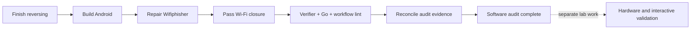

# RF Swift Nix remaining work

Last updated: 2026-08-25

This is the live handoff checklist for the Docker-to-Nix parity and verification
audit. The intended scope is the security-assessment tooling already present in
`RF-Swift-images`; no unrelated tools need to be added.

## Current status

The catalog, Nix evaluation checks, lazy-mode metadata, GNU Radio OOT closure,
CI workflow, and RF Swift Go CLI improvements have been implemented. Thirteen of
the fourteen environment closures have passed real builds plus declared-command
smoke tests:

- `ad`
- `android`
- `automotive`
- `bluetooth`
- `cyberether`
- `hardware`
- `network`
- `osint`
- `rfid`
- `sdr_full`
- `sdr_light`
- `telecom`
- `wifi`

`reversing` is the last environment. Its closure (Ghidra, Cutter, Wine, x64dbg,
OllyDbg, Pwndbg, Joern, Unblob, volatility3, ...) is large: on a disk-constrained
host build it component-by-component or with the binary cache. `angr` is a
documented gap in this environment for the current nixpkgs pin - see below.

### Build fixes completed since the last update

- `android`: `drozer` shipped a bundled `d8` dexer with a `#!/bin/bash` shebang
  that the pure builder has no interpreter for, so its agent APKs never compiled;
  `patchShebangs` fixes it. `billiard` (via MobSF's celery/libsast) has a
  sandbox-racy `test_set_pdeathsig`, now deselected.
- `wifi`: Wifiphisher's `setup.py` `shutil.rmtree('tmp')` cleanup is guarded with
  `ignore_errors=True` (the deferred fix); the full closure now passes.
- `reversing`: Unblob's `fs` dependency imported the removed `pkg_resources`
  (setuptools 81+); its opener discovery is ported to `importlib.metadata`.
- `tests/verify.sh`: the per-derivation eval loop now quotes the attribute name,
  so dotted custom packages (e.g. `pkg-python3Packages.pycrate`) force correctly.

### `angr` is a documented gap in `reversing`

This nixpkgs snapshot ships angr 9.2.193 with pycparser 3.00, a rewrite that
removed the PLY parser angr's C-type engine drives (writable `clex.filename`,
`self.cparser`, a `parameter_declaration` start symbol). `import angr` fails. The
only correct fix pins pycparser to 2.x for the environment, which overrides the
python package set and busts the binary-cache hits of the whole meson/python
native stack (gtk4, wine, gdk-pixbuf, pipewire), forcing tens of GiB of
from-source rebuilds. `pkgs/angr.nix` keeps the correct derivation (now also
adding the missing `msgspec` dep) so angr returns for free when nixpkgs' angr
supports pycparser 3.00 or the pin advances. See `environments.nix` reversing.

## Final software gates

Status of the software gates on the current tree:

```bash
./tests/verify.sh   # PASSES: catalog sync, every env + every pkg-* force to a .drv
git diff --check     # clean
```

In the sibling `RF-Swift` Go repository (all green):

```bash
go build ./... && go vet ./... && go test ./...
```

`actionlint` passes on every workflow in both repositories (`ci.yml`,
`security-audit.yml`, and the Go repo's `go.yml`/`release.yml`/`security.yml`).
Thirteen of fourteen closures build and pass their command smoke test; the
fourteenth (`reversing`) builds every tool except the documented `angr` gap.

## Security / vulnerability audit

`scripts/security-audit.sh` audits the bundled tool surface for known
vulnerabilities and supply-chain / integrity / configuration problems, layering
vulnix (Nix-closure CVEs), syft (SBOM), grype (SBOM CVEs + SARIF), and
osv-scanner (OSV/GHSA), plus `nix store verify` (corruption), signature
provenance, and flake.lock / placeholder-hash / insecure-package hygiene. It is
fault-tolerant (every scan runs; it never aborts mid-audit), prints a colour +
emoji report, and can emit `stdout`, `txt`, `json`, `html`, and `pdf` via
`--format`. `--fail-on LEVEL` turns it into a gate. `.github/workflows/security-audit.yml`
runs it weekly, on manual dispatch (with `fail_on` / `format` inputs), and on
pull requests that touch the packaging, uploading reports/SBOMs as artifacts and
grype SARIF to code scanning.

## RF Swift Go CLI: store maintenance

`rfswift nix gc` reclaims disk by running `nix store gc` (created environments
keep a gcroot, so built environments are never deleted). Supports `--dry-run` and
`--max <size>`. See `go/rfswift/nix/maintenance.go` and `cli/nix.go`.

## Completion boundary

A green fourteen-profile matrix proves Nix evaluation, closure realization, and
presence of every declared `meta.mainProgram`. It does not prove live radio,
USB, CAN, NFC/RFID, Bluetooth, privileged networking, Android-device, audio, or
GUI behavior. Those require documented machine-in-the-loop tests with supported
hardware and firmware. The final report must keep those hardware/interactive
gates separate from software build success.

## Follow-up assurance work

These items strengthen confidence after the x86_64 Linux software matrix is
green. They should not be confused with a source-build failure in the current
port.

### Automated parity report

Generate a machine-readable comparison between every Docker environment and
`environments.nix`. The report should classify each Docker tool as matched,
renamed/replaced, deliberately omitted, or missing, and fail CI when an
unreviewed difference appears. This replaces the remaining manual portion of
the current inventory review.

Success evidence: a checked-in generator/test whose output covers every tool in
both repositories and contains no unclassified entries.

### Deterministic functional fixtures

Add small offline fixtures that test behavior rather than only executable
presence. Cover at least one representative of each packaging shape:

- native compiled CLI;
- Python application and import closure;
- Java application;
- GNU Radio plus an RF Swift OOT block;
- GUI/AppImage wrapper in a headless-safe mode;
- prebuilt vendor library or executable.

Success evidence: each fixture has an exact expected result and runs in CI
without network access, radio hardware, or privileged host mutation.

### Additional platform contract

Run the package/profile matrix on native aarch64 Linux workers. For Darwin,
either publish an intentionally reduced environment/tool contract or remove it
from the advertised supported systems; silently omitting Linux-only security
tools is not full parity.

Success evidence: native aarch64 build logs and an explicit per-platform support
table. Darwin is complete only when its documented contract and observed
closures agree.

### Hardware and interactive validation

Create a lab matrix containing device model, USB/radio chipset, firmware,
permissions/udev requirements, test command, expected result, and last passing
date. Separate at least SDR, CAN, RFID/NFC, Bluetooth, hardware programmers,
Wi-Fi monitor/injection, and Android-device paths.

Success evidence: repeatable machine-in-the-loop logs. CI command-presence checks
must never be presented as proof of RF transmission, packet injection, USB
access, audio, or GUI rendering.

### Release hardening

Build the Go CLI into a clean staging directory, reject unexpected artifacts,
generate checksums and an SBOM, and sign the binary plus manifests. Preserve Go
module provenance while retaining the current stripped release flags.

Success evidence: a release workflow that reproduces the expected target set,
verifies signatures/checksums, and contains no files inherited from a developer's
local `bin/` directory.


