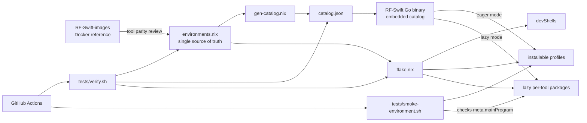

# RF Swift Nix verification audit

Last updated: 2026-08-24

This is the living verification record for the RF Swift Nix engine. It separates
what was evaluated, what was actually built and executed, and what still needs
proof. A successful Nix evaluation is useful, but it is not presented here as
proof that a source package compiles.

## System under test

RF Swift is split across three sibling repositories:

- `RF-Swift-images` is the existing Docker implementation and the reference for
  environment intent and tool selection.
- `RF-Swift-nix` defines reproducible native Nix environments and packages.
- `RF-Swift` contains the Go CLI, including the Nix environment lifecycle and an
  embedded snapshot of `RF-Swift-nix/catalog.json`.



## Tool coverage inventory

The catalog currently contains 14 environments and 433 package references.
References are not unique tools because common layers intentionally overlap.

| Environment | Package references | Explicit gaps | Category |
|---|---:|---:|---|
| `ad` | 17 | 0 | Network |
| `android` | 18 | 0 | Mobile |
| `automotive` | 10 | 0 | Automotive |
| `bluetooth` | 23 | 1 | Bluetooth |
| `cyberether` | 7 | 0 | SDR |
| `hardware` | 25 | 0 | Hardware |
| `network` | 97 | 0 | Network |
| `osint` | 22 | 0 | OSINT |
| `reversing` | 41 | 1 | Reversing |
| `rfid` | 19 | 0 | RFID |
| `sdr_full` | 44 | 0 | SDR |
| `sdr_light` | 32 | 0 | SDR |
| `telecom` | 36 | 1 | Telecom |
| `wifi` | 42 | 1 | WiFi |

The four deliberate, documented gaps are:

- Bluetooth: BreakTooth/blerp needs a custom Scapy fork and device firmware.
- Telecom: jSS7 has a 17-module Maven dependency closure that is not currently
  fetchable in the Nix sandbox.
- Wi-Fi: BeEF is a Ruby service/framework rather than a simple CLI package.
- Reversing: angr 9.2.193 (this nixpkgs pin) is incompatible with pycparser 3.00;
  pinning pycparser to 2.x for the environment would bust the binary cache of the
  whole meson/python native stack. `pkgs/angr.nix` keeps the ready derivation;
  angr returns when nixpkgs' angr supports pycparser 3.00 or the pin advances.

“Zero explicit gaps” means the intended tools have package references. It does
not by itself prove behavioral parity with a Docker image. Hardware access,
GUI/audio operation, radio firmware, and privileged network behavior require
machine-in-the-loop tests.

## Verification levels

The project uses distinct evidence levels so a shallow check cannot be mistaken
for a build result.

| Level | Evidence | Command |
|---|---|---|
| Catalog | JSON parses, regenerates exactly, CLI snapshot matches | `./tests/verify.sh` |
| Evaluation | Every environment and exposed custom derivation forces to a `.drv` | `./tests/verify.sh` |
| Build | Nix realizes the entire environment closure | `./tests/smoke-environment.sh <environment>` |
| Command | Every package with `meta.mainProgram` exposes that executable in the closure | same smoke command |
| Functional | A tool processes a deterministic fixture and produces expected output | tool-specific tests, still being expanded |
| Hardware | A tool opens and exchanges data with its supported device | dedicated hardware runner/manual lab |

`nix develop .#environment` evaluation is not a sufficient gate. It can leave
package fields lazy and previously allowed a broken Android environment to look
healthy. CI now forces `packages.x86_64-linux.<environment>.drvPath`, and build
jobs are no longer allowed to fail silently.

The verifier intentionally forces custom packages in separate Nix processes.
A monolithic `nix flake check --no-build` retained the whole RF Swift graph and
was OOM-killed during this audit; per-derivation evaluation provides the same
forcing evidence with bounded peak memory.

## Evidence collected on 2026-08-24

Host: `x86_64-linux`, Nix 2.35.2.

- `catalog.json` regenerated identically from `environments.nix`.
- The Go binary's embedded `nix/catalog.json` matched the Nix repository catalog.
- The final bounded-memory `./tests/verify.sh` run passed all four stages: it
  forced all 14 x86_64 Linux environment profiles and every exposed `pkg-*`
  derivation, then rechecked both catalog representations.
- `go test ./...` passed for all RF Swift Go packages.
- `go vet ./...` passed without diagnostics.
- A release-flag build (`-trimpath -ldflags="-s -w"`) produced a working,
  stripped 16 MiB Linux amd64 CLI, versus approximately 22 MiB for the inspected
  debug-bearing artifact. `go version -m` still reported module provenance.
- The complete `automotive` closure built successfully. This included local
  source builds for CANtact, Caring Caribou, socketcand, and V2GInjector.
- The automotive smoke test verified seven declared entry points: `can`,
  `caringcaribou`, `cantools`, `SavvyCAN`, `socketcand`, `V2GInjector`, and
  `wireshark`.
- The complete `ad` closure built successfully and its smoke test verified 13
  declared entry points, including the locally packaged BloodyAD and lsassy.
- The complete `osint` closure built successfully and its smoke test verified
  18 declared entry points.
- The complete `rfid` closure built successfully and its smoke test verified 13
  declared entry points. This included a source build of NFC Laboratory and
  separate working `pm3` and `pm5` wrappers. Although the aggregate profile
  reports shared-file collisions between the Proxmark packages, each wrapper
  contains absolute references to its own immutable store prefix and resources.
- The complete `bluetooth` closure built successfully and its smoke test
  verified 15 declared entry points after correcting WHAD's lazy entry point.
- The complete `hardware` closure built successfully and its smoke test
  verified 16 declared entry points, including the Saleae FHS/AppImage wrapper
  and DSView.
- The complete `telecom` closure built successfully and its smoke test verified
  18 declared entry points. This included cold source builds of OCUDU,
  OpenBTS, OpenBTS-UMTS, MMT-DPI, OsmoTRX, and the legacy ASN.1 generator.
  Pycrate's protocol fixtures ran with an AES backend and its formerly missed
  SEDebugMux module passed an explicit import check.
- The complete `cyberether` closure built successfully and its smoke test
  verified three declared entry points: `cyberether`, `rtl_sdr`, and
  `SoapySDRUtil`. The source build completed all 505 Ninja steps, including the
  compositor translation unit, final application link, install, and fixup.
- `nix run .#cantact -- --help` executed the corrected CANtact entry point.
- `nix run .#v2ginjector -- --help` launched V2GInjector. Its upstream program
  enters an interactive console rather than implementing a conventional help
  exit, which should be considered when adding automated functional fixtures.
- The statically linked stripped CLI generated Bash completion text on stdout
  without a banner or filesystem write after the completion fix.

This is not yet proof that all 14 closures compile. The CI matrix is now the
authoritative all-environment build gate, but a complete green matrix has not
yet been observed for the current tree. Do not label the full Nix port complete
until that evidence exists.

## Defects found and fixed

### Android environment did not force

`objection` transitively requires the Android SDK. The flake allowed unfree
packages but did not set `android_sdk.accept_license`, so the installable Android
profile failed during evaluation. The setting is now applied to both package
sets used by eager and lazy operation.

### `unblob` Python 3.14 override was incomplete

The custom repair replaced the legacy `propagatedBuildInputs` dependency but not
the current Python package `dependencies` field. As a result, `unblob` still
selected nixpkgs' broken `fs` derivation. Both dependency representations are
now overridden and the intentional `fs` broken marker is cleared locally.

### CANtact lazy command was wrong

The crate/package is named `cantact`, but it installs a binary named `can`.
`meta.mainProgram` incorrectly named `cantact`, causing `nix run` and RF Swift
lazy shims to target a nonexistent executable. It now declares `can`, and the
real command has been executed.

### WHAD declared a nonexistent command

WHAD exposes a family of commands such as `whadup`, `wsniff`, and
`wble-central`, but it does not install a binary named `whad`. Its package
metadata named that nonexistent binary, so the Bluetooth closure built while
lazy dispatch still failed. `meta.mainProgram` now selects upstream's generic
device discovery and information command, `whadup`; the rebuilt Bluetooth
closure exposes it and passes the command smoke test. Secondary WHAD commands
remain accessible through the interactive lazy command fallback.

### CI could report weak success

The old evaluation job checked dev shells, which did not catch the Android
failure. The environment build matrix was also marked `continue-on-error`, so a
red build did not make the workflow red. CI now forces installable profiles,
builds each closure as a required gate, and verifies declared entry points.

### GNU Radio lazy mode selected a diagnostic command

nixpkgs declares `gnuradio-config-info` as GNU Radio's main program. RF Swift
lazy mode uses `meta.mainProgram` to name its on-demand shim, so a new lazy SDR
environment did not expose the expected `gnuradio-companion` command. The
`gnuradio-rfswift` wrapper now declares `gnuradio-companion`. Its first call
realizes GNU Radio and the complete bundled OOT closure; subsequent calls reuse
it from the Nix store.

The bundle now covers the full default OOT set from RF-Swift-images
(`scripts/gr_oot_modules.sh`): 53 modules build and are bundled. Beyond the
original set (osmosdr fork, lora_sdr, DIFI, fosphor, RDS, Iridium, satellites,
GSM, AIS, LimeSDR, Tempest, DAB, Foo, ADS-B, Paint, DECT2, NFC, air-modes,
IEEE 802.11, IEEE 802.15.4) this adds gr-lora, gr-inspector, gr-uaslink, gr-X10,
gr-gfdm, gr-aaronia_rtsa, gr-aistx, gr-dvbs2, gr-ieee802-11ah, gr-ieee80211,
gr-droneid, gr-keyfob, gr-radar, gr-nordic, the Sandia suite (pdu_utils,
timing_utils, sandia_utils, fhss_utils), gr-zwave_poore, gr-mixalot, gr-reveng,
gr-j2497, gr-m17, gr-grnet, gr-aoa, gr-correctiq, gr-dsd, gr-nrsc5, gr-ntsc-rc,
gr-mer, gr-flarm, gr-guiextra, gr-rftap, gr-radio_astro and gr-cessb. Several
required packaging out-of-nixpkgs deps: itpp (gr-dsd, gr-mixalot), turbofec
(gr-flarm, gr-droneid), CRCpp (gr-droneid), an HDC-patched fdk-aac (gr-nrsc5),
and libspectranstream (gr-aaronia_rtsa). One module, gr-DCF77_Receiver, is a
documented gap: upstream ships only GRC flowgraphs/scripts with no CMake module
to install. All 53 modules and the assembled `gnuradio-rfswift` wrapper build,
and every `pkg-*` (including these) forces cleanly under `tests/verify.sh`.

The OOT modules are not installed as a second step after GNU Radio launches.
`gnuradio-rfswift` is a single GNU Radio derivation configured with
`extraPackages`; consequently its Python paths, GRC block definitions, shared
libraries, and runtime dependencies are assembled into the same immutable Nix
closure. Lazy mode only postpones realization of that complete closure:

```mermaid
sequenceDiagram
    actor User
    participant Shim as gnuradio-companion lazy shim
    participant Nix
    participant Store as Nix store
    participant GRC as GNU Radio Companion

    User->>Shim: gnuradio-companion
    Shim->>Nix: build pkg-gnuradio-rfswift
    Nix->>Store: download cached paths or compile missing paths
    Note over Store: GNU Radio + bundled OOT modules + dependencies
    Nix-->>Shim: complete immutable closure path
    Shim->>GRC: exec closure/bin/gnuradio-companion
    GRC->>Store: discover bundled blocks and libraries
    User->>Shim: later invocation
    Shim->>Nix: request the same derivation
    Nix-->>Shim: already present; no rebuild
    Shim->>GRC: exec immediately
```

This depends on calling the declared lazy entry point,
`gnuradio-companion`. Other executables shipped by the same derivation become
available through RF Swift's interactive Bash `command_not_found_handle`, which
can locate and realize their providing package. A direct non-interactive command
does not get that fallback, so automation should invoke `gnuradio-companion` or
use an explicit `rfswift nix run` command.

### Legacy `asn1c` used a host-only interpreter path

OpenBTS-UMTS pins `asn1c` 0.9.23, whose example generators use
`#!/usr/bin/env perl`. Pure Nix builders intentionally provide no `/usr/bin`,
so a full telecom build failed even though derivation evaluation passed. The
package now patches all source shebangs during `postPatch`; an isolated build of
the corrected compiler, including its generated example inputs, passes.

### OCUDU's SBOM hook rejected a Nix install

OCUDU compiled and linked all targets, then its vendored `cmake-sbom` install
hook checked a binary before it was visible at the Nix install prefix and
aborted. The target records are now optional during SBOM generation while the
project SBOM is retained. The environment smoke test remains responsible for
proving that the actual declared executables were installed; the corrected
full telecom rebuild subsequently passed.

### OpenBTS transceiver installed into the host root

OpenBTS compiled and linked, but its hand-written `Transceiver52M` install rule
tried to create `/OpenBTS` instead of writing beneath the Nix output. The apps
rule had already been redirected, but the separate transceiver rule had not.
Both now use the configured prefix; an isolated OpenBTS rebuild and the final
telecom closure passed installation and fixup.

### Pycrate silently omitted runtime protocol dependencies

Pycrate's upstream install-check driver prints tracebacks without returning a
failure. It revealed that `pycrate_osmo.SEDebugMux` lacked `crcmod` and that no
AES backend was present, disabling EEA2/EIA2 support. RF Swift now overrides
the package with `crcmod` and `cryptography`, and adds SEDebugMux to the strict
Python import gate. The final telecom build no longer reports the missing AES
backend and passes the additional import check.

### CyberEther exceeded small-builder memory

A parallel CyberEther build reached 469 of 508 objects, then GCC's `cc1plus`
was killed by the kernel while sharing a 5.2 GiB host with OCUDU. This was an
OOM event, not a compiler diagnostic. CyberEther's internal Ninja build is now
serialized for reliable local and small self-hosted builders; environment-level
CI parallelism is unaffected. The serialized rebuild passed the formerly killed
compositor translation unit, then exposed an independent final-link failure:
the compiled `cpp-httplib` subproject did not supply its WebSocket client
symbols. Selecting upstream's supported header-only mode resolved the mismatch.
The resulting package and full CyberEther environment closure now build, and
all three declared commands pass the executable smoke gate.

### Completion generation unexpectedly modified the host

The documented `rfswift completion bash > file` form actually installed directly
into `/etc/bash_completion.d/rfswift` and printed status text, so redirection did
not receive a completion program. Generation is now side-effect-free by default
and writes only the requested script to stdout. Host installation requires the
explicit `--install` flag. Generation for Bash, Zsh, Fish, and PowerShell has
unit coverage.

## Binary review and improvement backlog

The CLI's Nix packages and tests are a solid base, but these improvements remain
worth doing in `RF-Swift`:

1. Add CLI integration tests with a fake `nix` executable. Unit tests cover
   catalog/path helpers, but eager creation, lazy shim generation, error
   propagation, export/import, and `--engine nix` routing need command-level
   fixtures without network access.
2. Make catalog synchronization an automated cross-repository release step.
   The snapshots match today, but independent commits can make the binary stale.
3. The Makefile now builds with `-trimpath -ldflags="-s -w"`; keep this as a CI
   invariant and additionally inject version, commit, and build date through
   `-X` flags. The change reduced the audited amd64 build from about 22 MiB to
   16 MiB while preserving Go module provenance.
4. Produce checksums and an SBOM for every release target, and sign both the
   checksum manifest and binaries. Go module build information is already
   embedded and can feed provenance generation.
5. Clean the release output directory before packaging and reject unexpected
   files. The inspected local `bin/` contains several zero-byte accidental files
   alongside the platform binaries; packaging should use an isolated staging
   directory rather than whatever happens to be in `bin/`.
6. Add a non-interactive/version probe to every custom tool package where
   upstream permits it. `meta.mainProgram` proves dispatch, while a deterministic
   probe catches wrappers that start but cannot import their runtime dependencies.
7. Surface platform omissions to the CLI. The flake currently traces and drops
   unavailable packages, but users should be able to inspect the exact resolved
   versus omitted set before creating an environment.

## Remaining completion gates

- Observe a green required build-and-command matrix for all 14 x86_64 Linux
  environments on the pinned lock file.
- Add deterministic functional fixtures for representative native, Python,
  Java, GUI-wrapper/headless, GNU Radio OOT, and vendor-library packages.
- Test aarch64 Linux builds on native aarch64 workers. Cross-platform evaluation
  alone does not prove compilation.
- Decide whether Darwin is truly supported. Many RF/security packages are
  Linux-only and are silently omitted; publish a platform-specific contract or
  narrow the advertised systems.
- Run hardware lab checks for the SDR, RFID/NFC, Bluetooth, CAN, and programmer
  stacks with a documented device/firmware matrix.
- Complete a scripted Docker-image-to-Nix parity report rather than relying only
  on the current catalog inventory and manual script review.

## Reproduction

```bash
cd RF-Swift-nix
./tests/verify.sh
./tests/smoke-environment.sh automotive

cd ../RF-Swift/go/rfswift
go test ./...
go vet ./...
```

For a full local build audit, run the smoke script once for every name returned
by `jq -r '.environments[].name' catalog.json`. Expect large downloads and long
source builds; CI is the preferred authoritative runner and binary-cache feeder.
