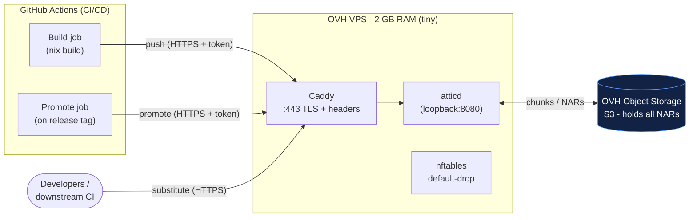
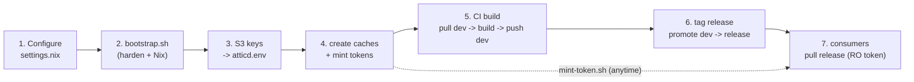
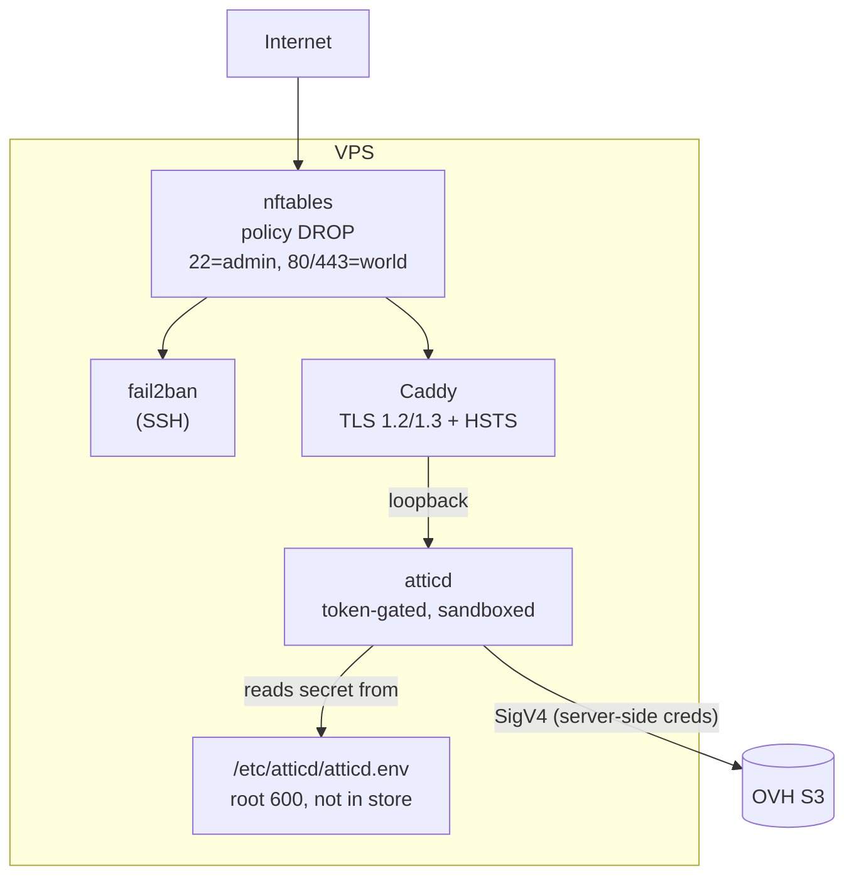
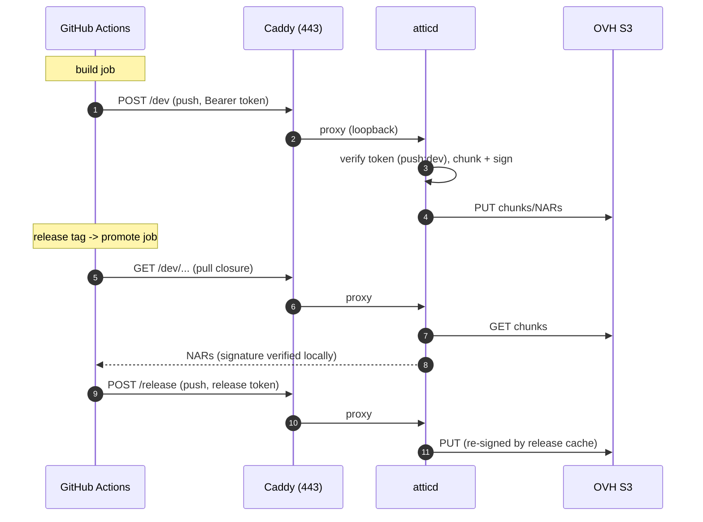

# RF-Swift Nix binary cache - setup

A hardened, S3-backed Nix binary cache for CI/CD, split into a **dev** cache and
a promoted **release** ("final") cache, running on a tiny OVH VPS. The VPS holds
almost no data: the NARs live in OVH Object Storage (S3), and the box only runs
`attic` (the cache server) behind `caddy` (TLS). The whole machine is configured
declaratively with Nix via `system-manager`, because OVH does not offer NixOS.

---

## 1. Architecture



Two DNS names resolve to the same VPS and the same `atticd`; the cache name in
the URL path selects which logical cache you hit:

| Purpose | Public URL (substituter) | attic cache |
|---|---|---|
| Dev / branch builds | `https://dev-cache.example.com/dev` | `dev` |
| Promoted releases | `https://cache.example.com/release` | `release` |

### Components

| Layer | Software | Role | Where it runs |
|---|---|---|---|
| Storage | OVH Object Storage (S3) | Holds every NAR/chunk | OVH (not the VPS) |
| Cache server | `attic-server` (`atticd`) | Nix cache API, tokens, signing, dedup, GC | VPS, loopback only |
| TLS / edge | `caddy` | HTTPS, security headers, reverse proxy | VPS, ports 80/443 |
| Firewall | `nftables` | Default-drop; 80/443 public, 22 admin-only | VPS |
| Intrusion prevention | `fail2ban` | Ban SSH brute-forcers | VPS |
| Memory headroom | `zram` | Compressed swap | VPS |
| Config management | `system-manager` + this flake | Declarative, reproducible host config | VPS |

### The whole process, in order



1. **Configure** `settings.nix` (hosts, S3, admin CIDRs, your SSH key).
2. **Provision** the VPS: `sudo ./scripts/bootstrap.sh` (creates admin user,
   installs Nix, applies the hardened config, disables root SSH).
3. **Secrets**: put OVH S3 keys in `/etc/atticd/atticd.env`; `systemctl restart atticd`.
4. **Caches + tokens**: create `dev`/`release`, mint a pull+push CI token, a
   promote token, and a pull-only reader token (`mint-token.sh` for more later).
5. **CI build**: `use-cache.sh dev` (pull) -> `nix build` -> `push-to-cache.sh dev` (push).
6. **Promote** on a release tag: `promote.sh` copies the closure dev -> release.
7. **Consume**: developers/downstream point Nix at `release` with a read token.

Full detail for each step is below.

---

## 2. Security model

Because the CI is GitHub-hosted (no VPN, and GitHub's egress IPs are too broad
to allowlist), access control rests on **tokens over TLS**, not network position.

- **Nothing is public except 80/443.** `atticd` binds `127.0.0.1` only; the
  firewall drops everything except HTTP(S) and SSH-from-admin.
- **Caches are private.** Every pull and push needs an attic token minted from
  the server's HS256 secret. There is no anonymous read.
- **Least-privilege tokens.** GitHub gets a *push-only* token scoped to a single
  cache. Consumers get a *pull-only* token. The signing/HS256 secret never
  leaves the VPS.
- **SSH is closed to CI entirely.** Port 22 is limited to your admin CIDRs and
  rate-limited; root SSH is disabled; key-only auth. GitHub reaches the box only
  over 443.
- **Secrets stay out of Nix.** S3 keys and the token secret live in
  `/etc/atticd/atticd.env` (root, `chmod 600`) referenced by the systemd unit -
  never in git or the world-readable `/nix/store`.
- **Signed artifacts.** attic signs NARs; clients verify with the cache public
  key, so even a compromised bucket cannot inject a trusted path.
- **Hardened services + kernel.** systemd sandboxing on `atticd`/`caddy`,
  sysctl hardening, HSTS + security headers, automatic OS security updates.



---

## 3. Prerequisites

1. **OVH VPS** (the cheapest with >=2 GB RAM), fresh **Debian 12** or **Ubuntu
   22.04+**, with a public IPv4 (and IPv6 if you want it).
2. **OVH Object Storage bucket** with the **S3 API** enabled. Note the endpoint
   (e.g. `https://s3.gra.io.cloud.ovh.net`), region (`gra`), and bucket name.
   Create an **S3 user / access key** with read-write on that bucket.
3. **A domain** you control, with two records:
   - `dev-cache.example.com  A  <vps-ip>`
   - `cache.example.com      A  <vps-ip>`
   (add `AAAA` too if using IPv6). DNS must resolve before first boot so Caddy
   can complete the ACME challenge.
4. An **SSH keypair** for admin access.

---

## 4. Repo layout

```
nix-cache-infra/
  flake.nix              # system-manager entrypoint
  settings.nix           # <-- edit: hosts, S3, admin CIDRs, keys
  modules/
    attic.nix            # atticd server (S3 backend, sandboxed)
    cache-proxy.nix      # Caddy TLS + reverse proxy
    hardening.nix        # nftables, sysctl, sshd, fail2ban
    zram.nix             # compressed swap
  scripts/
    bootstrap.sh         # provision a fresh VPS (run once, as root)
    lib.sh               # shared: reads hosts/cache names from settings.nix
    gen-secrets.sh       # print an atticd.env with a fresh token secret
    mint-token.sh        # generate scoped tokens on demand (VPS)
    use-cache.sh         # CI: enable a cache as substituter (PULL)
    push-to-cache.sh     # CI: push a closure to dev/release (PUSH)
    promote.sh           # CI: promote dev -> release
  SETUP.md               # this file
```

All CI scripts source `lib.sh`, which reads `devHost`/`releaseHost`/cache names
from `settings.nix` - so the scripts **carry the domain themselves** and CI only
ever passes a token, never a URL.

### Scripts at a glance

| Script | Runs on | Needs | Does |
|---|---|---|---|
| `bootstrap.sh` | VPS (root) | `settings.nix` | user, Nix, hardened config, updates |
| `gen-secrets.sh` | anywhere | `openssl` | print a fresh `atticd.env` |
| `mint-token.sh` | VPS | HS256 secret | mint a scoped token (presets/custom) |
| `use-cache.sh` | CI | `ATTIC_TOKEN` | enable cache as substituter (pull) |
| `push-to-cache.sh` | CI | `ATTIC_TOKEN` | push closure to dev/release |
| `promote.sh` | CI | `ATTIC_TOKEN`, `DEV_PUBLIC_KEY` | copy dev -> release |

---

## 5. Deploy

### 5.1 Configure

Edit `settings.nix`: set `devHost`, `releaseHost`, `acmeEmail`, the `s3` block,
`sshAllowedCIDRs` (your admin IPs - **do not leave `0.0.0.0/0`**), `adminUser`,
and paste your public key(s) into `adminSSHKeys`.

### 5.2 Bootstrap the VPS

Copy the repo to the box and run the provisioner as root:

```bash
scp -r nix-cache-infra root@<vps-ip>:/root/
ssh root@<vps-ip>
cd /root/nix-cache-infra
./scripts/bootstrap.sh
```

It creates the admin user + installs your keys, installs Nix, applies the
hardened config (`system-manager switch`), enables `unattended-upgrades`, and
disables root SSH. **Before closing the root session**, open a second terminal
and confirm you can `ssh <adminUser>@<vps-ip>`.

### 5.3 Put the real S3 keys in place

`bootstrap.sh` seeds `/etc/atticd/atticd.env` with a random token secret and
placeholder S3 keys. Edit it and restart:

```bash
sudo sed -i 's/REPLACE_WITH_OVH_S3_ACCESS_KEY/<key>/;s/REPLACE_WITH_OVH_S3_SECRET_KEY/<secret>/' /etc/atticd/atticd.env
sudo systemctl restart atticd
sudo systemctl status atticd caddy
```

(Use `./scripts/gen-secrets.sh` on your laptop if you prefer to generate the
file yourself and copy it over.)

---

## 6. Create caches and tokens

On the VPS, `atticadm` talks to the running server using the same HS256 secret.

```bash
# Load the secret into the shell (atticadm reads it from the env).
export ATTIC_SERVER_TOKEN_HS256_SECRET_BASE64=$(sudo grep -oP '(?<=HS256_SECRET_BASE64=).*' /etc/atticd/atticd.env)

# One-time admin token to drive the client, then create the two caches.
ADMIN=$(atticadm make-token --sub admin --validity '1y' --pull '*' --push '*' --create-cache '*')
attic login local http://127.0.0.1:8080 "$ADMIN"
attic cache create dev
attic cache create release
# Keep dev/release private (default). Do NOT run 'attic cache configure --public'.
```

Mint least-privilege tokens. Each token carries exactly the caches and verbs it
needs - a build job pulls *and* pushes; a consumer only pulls:

```bash
# CI build token: PULL + PUSH on dev. The build reads dev to skip already-cached
# derivations, then pushes the new ones back. Scoped to dev only.
atticadm make-token --sub gh-dev  --validity '90d' --pull 'dev'  --push 'dev'

# CI promote token: PULL dev (to fetch the closure) + PUSH release.
atticadm make-token --sub gh-rel  --validity '90d' --pull 'dev'  --push 'release'

# Pull-only token for developers / downstream CI: read both caches, no push.
atticadm make-token --sub reader  --validity '180d' --pull 'dev' --pull 'release'
```

Token capability recap:

| Token | Caches / verbs | Lives as |
|---|---|---|
| `gh-dev` | pull+push `dev` | GitHub secret `ATTIC_TOKEN_DEV` |
| `gh-rel` | pull `dev`, push `release` | GitHub secret `ATTIC_TOKEN_RELEASE` |
| `reader` | pull `dev`+`release` | distributed to consumers (`ATTIC_TOKEN_RO`) |

Store the CI tokens as GitHub Actions **secrets**. The `--push` verb implies
pull on that cache, so a push token can also read; keep push tokens off consumer
machines and hand those the pull-only `reader` token.

**Generating more tokens later** (new consumers, extra CI, rotations) - use the
helper instead of remembering flags. It reads the secret from `atticd.env`:

```bash
sudo ./scripts/mint-token.sh reader alice        # pull-only, dev+release, 90d
sudo ./scripts/mint-token.sh ci-dev  ci-fork 30d # pull+push dev, 30 days
sudo ./scripts/mint-token.sh ci-rel  releaser    # pull dev, push release
# Anything bespoke - pass raw atticadm flags after '--':
sudo ./scripts/mint-token.sh custom audit 7d -- --pull release
```

To **rotate/revoke**: mint a replacement and update the secret; to invalidate
*every* token at once, change the HS256 secret in `atticd.env` and
`systemctl restart atticd`.

Also grab the public keys clients must trust:

```bash
attic cache info dev      # shows the public key -> dev:BASE64...
attic cache info release  # shows the public key -> release:BASE64...
```

---

## 7. GitHub Actions integration

The scripts derive endpoints from `settings.nix` (committed in the repo), so the
jobs pass only the token secret. The build job **pulls** from dev first (to skip
cached derivations) and **pushes** the results back with the same pull+push
token.

### 7.1 Build - pull, upload while building, push to dev

The real workflows are `.github/workflows/cache-amd64.yml`, `cache-arm64.yml`
and `cache-riscv64.yml` (do not copy YAML from this document; GitHub only picks
up `.yml`/`.yaml` files under `.github/workflows/`). Each does, per environment
listed in `catalog.json` (matrix, `fail-fast: false`):

1. `use-cache.sh dev` - logs in with `ATTIC_TOKEN_DEV` and wires
   `https://<devHost>/dev` in as a substituter, so cached paths are downloaded.
2. `attic watch-store dev` runs in the background for the whole build and
   uploads every store path as soon as it is realised. If one package in an
   environment fails, everything built before it is already in the cache, so
   the next run starts where this one stopped.
3. `nix build .#packages.<system>.<env> --keep-going` (via
   `.github/scripts/build-cache-report.sh`, which also produces the report).
4. `push-to-cache.sh dev <out>` - pushes the finished closure (catches anything
   the watcher had not flushed).

Triggers: every branch push and every `v*` tag (pull + push) for amd64 and
arm64; riscv64 (QEMU, slow) only on `main`, tags and manual dispatch. Pull
requests from forks get no secrets, so they simply build without the cache. The runner needs `trusted-users = root runner` in `nix.conf` because
`attic use` adds the substituter to the runner user's own configuration.

### 7.2 Promote dev -> release (on a tag)

`.github/workflows/promote-release.yml`, on `v*` tags or manual dispatch. Per
environment and system (x86_64, aarch64, riscv64) it runs `use-cache.sh dev`
(the release token can pull dev), fetches the closure with
`nix build --max-jobs 0` (download only, never compiles), then `promote.sh
<out>` pushes it to `release`, where attic re-signs it. Secrets: `ATTIC_TOKEN_RELEASE` and `CACHE_PUBLIC_KEY_DEV`.

### 7.3 Consuming the cache (any client)

```bash
# On a developer machine or downstream runner:
attic login rfswift https://nixcache.penthertz.com <reader-token>
attic use release        # wires it into nix.conf for you
```

Or configure Nix directly (no attic client needed to *pull*):

```
# /etc/nix/nix.conf  (or ~/.config/nix/nix.conf)
substituters = https://nixcache.penthertz.com/release https://cache.nixos.org
trusted-public-keys = release:BASE64... cache.nixos.org-1:6NCHdD59X431o0gWypbMrAURkbJ16ZPMQFGspcDShjY=
netrc-file = /etc/nix/netrc         # holds the pull token for nixcache.penthertz.com
```



---

## 8. Operations

- **Garbage collection / retention.** attic GCs unreferenced chunks on the
  interval in `attic.nix`. Set per-cache retention:
  `attic cache configure dev --retention-period 30d`. Keep `release` longer.
- **Backups.** The only local state is `/var/lib/atticd/server.db` (SQLite) - the
  chunk store is in S3. Snapshot the DB nightly:
  `sqlite3 /var/lib/atticd/server.db ".backup /root/atticd-$(date +%F).db"`.
- **TLS renewal.** Automatic (Caddy). Nothing to do; certs persist in
  `/var/lib/caddy`.
- **Rotating tokens.** Mint new ones with `atticadm make-token`; update GitHub
  secrets. To revoke *everything at once*, rotate the HS256 secret in
  `atticd.env` and `systemctl restart atticd` (invalidates all tokens).
- **Monitoring.** `systemctl status atticd caddy nftables fail2ban`,
  `journalctl -u atticd -f`, `fail2ban-client status sshd`, `zramctl`.
- **Updating the host.** Edit `settings.nix`/modules, `git pull`, then
  `sudo system-manager switch --flake .#default`. Bump the `nixpkgs` input in
  `flake.nix` deliberately for package updates.

---

## 9. Cost sketch

- VPS: the smallest 2 GB OVH instance (a few EUR/month) - it only proxies.
- S3: pay per GB stored + egress. attic's chunking dedups aggressively, and
  putting the region close to your CI keeps egress cheap. Prune `dev` hard.

---

## 10. Validation and troubleshooting

```bash
# Server up and reachable over TLS?
curl -fsS https://cache.example.com/release/nix-cache-info

# Token works?
nix store info --store 'https://cache.example.com/release?trusted-public-keys=release:BASE64...'

# Firewall as expected? (22 from a non-admin IP should hang/fail)
sudo nft list ruleset

# atticd not starting -> almost always the S3 keys or token secret in atticd.env
journalctl -u atticd -n 50 --no-pager
```

Common gotchas:
- **Caddy cert fails**: DNS not pointing at the box yet, or port 80 blocked
  (ACME needs it). Check `journalctl -u caddy`.
- **`atticd` config keys**: attic evolves; if it rejects `server.toml`, check
  the field names against your installed version (`atticd --help`,
  `nix eval nixpkgs#attic-server.version`).
- **Locked out of SSH**: you left `adminSSHKeys` empty or mistyped a CIDR. Use
  the OVH web console (KVM/rescue) to fix `settings.nix` and re-run bootstrap.

---

## Appendix A - Simpler alternative: raw S3 + Caddy proxy (no attic)

If you would rather not run attic, you can push straight to S3 and let Caddy
serve it read-only:

- **Push (CI):** sign on upload and copy to S3.
  ```bash
  nix copy --to \
    's3://rfswift-nix-cache?endpoint=s3.gra.io.cloud.ovh.net&region=gra&secret-key=/path/dev.key' \
    $(nix build .#... --print-out-paths)
  ```
- **Serve (VPS):** Caddy reverse-proxies the two subdomains to the bucket's HTTP
  endpoint (objects must be readable by the proxy). Clients set
  `substituters = https://cache.example.com` + `trusted-public-keys`.
- **Promote:** `nix copy --from s3://...dev --to s3://...release` re-signed with
  the release key.

Trade-offs vs attic: **no dedup/chunking** (bigger S3 bill), **no built-in
tokens** (you gate access at Caddy with basic-auth or an allowlist, and rely on
signatures), and **no server-side GC** (use S3 lifecycle rules). Attic is the
better fit for "many CI builds, tiny VPS"; this variant is fewer moving parts.

Signing keys for this variant:

```bash
nix key generate-secret --key-name dev.example.com-1     > dev.key
nix key convert-secret-to-public < dev.key               > dev.pub
nix key generate-secret --key-name cache.example.com-1   > release.key
nix key convert-secret-to-public < release.key           > release.pub
```
